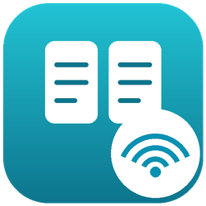
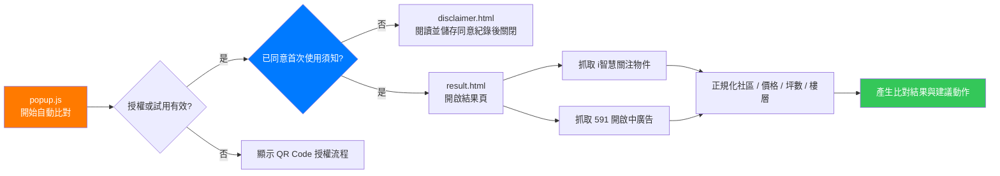

# 591 廣告 vs i智慧 自動比對工具

<p align="center">
  
</p>

<p align="center">
  輕量化 Chrome 擴充功能 - 一鍵比對 <a href="https://is.ycut.com.tw/">i智慧</a> 關注物件與 <a href="https://user.591.com.tw/">591 會員中心</a> 上架廣告
</p>

<p align="center">
  
  
  
  
</p>

## Features

- 自動抓取 i智慧「關注物件」清單
- 自動抓取 591 會員中心「開啟中物件」清單
- 比對社區名稱、總價、坪數、樓層等資料
- 列出價格不一致、591 多出的廣告、關注沒對應的物件
- 支援 591 API 抓取，異常時自動切換 DOM 備用模式
- 支援 i智慧 API 抓取，異常時自動切換 DOM 備用模式
- 內建使用須知確認、3 天試用與授權碼驗證
- 結果頁會顯示建議動作，方便快速修正或下架廣告

## Tech Stack

| 項目 | 技術 |
|------|------|
| 平台 | Chrome Extension (Manifest V3) |
| UI | HTML / CSS / JavaScript |
| 資料抓取 | Chrome Tabs API + Scripting API |
| 儲存 | Chrome Storage Local API |
| 授權驗證 | Cloudflare Workers API |
| 比對方式 | 社區名稱正規化 + 價格 / 坪數 / 樓層比對 |

## Architecture

```
AdMirror/
├── manifest.json           # 擴充功能設定 (Manifest V3)
├── popup.html              # 擴充功能入口 UI
├── popup.js                # 試用 / 授權驗證與開啟結果頁
├── disclaimer.html         # 獨立的首次使用須知與 readonly 重看頁
├── disclaimer.css          # 使用須知頁面樣式
├── disclaimer.js           # 捲動、同意、關閉與 readonly 操作
├── src/disclaimer.js       # 版本化同意紀錄的共用 storage 模組
├── result.html             # 比對進度與結果頁
├── result.js               # i智慧 / 591 資料抓取、比對與結果渲染
├── icon.png                # 擴充功能圖示
├── ★安裝說明★.html          # 圖文安裝與使用說明
├── result_test.txt         # 測試用文字檔
└── 自動對比廣告工具.zip      # 封裝後的工具壓縮檔
```

### 運作流程



## Installation

### 方法一：下載 ZIP 安裝

1. 下載此專案或 `自動對比廣告工具.zip`
2. 將 ZIP 解壓縮到固定資料夾
3. 開啟 Chrome，前往 `chrome://extensions/`
4. 右上角開啟 **開發人員模式**
5. 點擊 **載入未封裝項目**
6. 選擇解壓縮後的整個資料夾
7. 將「591 廣告 vs i智慧 自動比對工具」釘選到工具列

### 方法二：Clone 專案

```bash
git clone https://github.com/sir871364/AdMirror.git
```

接著依照上方步驟，到 `chrome://extensions/` 載入此資料夾。

## Usage

1. 先確認 Chrome 已登入 [i智慧](https://is.ycut.com.tw/) 與 [591 會員中心](https://user.591.com.tw/)
2. 點擊工具列上的擴充功能圖示
3. 若尚未授權，可使用 3 天試用或輸入授權碼
4. 按下 **開始自動比對**
5. 等待新分頁抓取資料並產生比對結果
6. 依照結果頁的建議動作修改價格、下架廣告或確認漏上架物件

## Result Types

| 狀態 | 意思 | 建議動作 |
|------|------|----------|
| 完美匹配 | i智慧與 591 的社區、價格等資料一致 | 不需處理 |
| 價格不一致 | 同社區但 i智慧與 591 價格不同 | 修改 591 廣告價格 |
| 591 多出 | 591 有上架，但 i智慧沒有對應關注物件 | 確認是否已成交，必要時下架 |
| 關注沒對應 | i智慧有關注，但 591 沒有對應廣告 | 確認是否漏上架 |

## Permissions

| 權限 | 用途 |
|------|------|
| `tabs` | 開啟背景分頁抓取 i智慧與 591 資料 |
| `scripting` | 在指定網站分頁內執行資料擷取程式 |
| `storage` | 儲存安裝 ID、試用狀態、授權碼與使用須知確認狀態 |
| `host_permissions` | 存取 i智慧、591 會員中心與授權驗證 API |

## Configuration

| 設定項目 | 預設值 | 說明 |
|----------|--------|------|
| 試用天數 | `3` 天 | 第一次使用時自動開始試用 |
| 授權產品 | `listing_compare` | 授權 API 用於辨識此工具 |
| 使用須知版本 | `1` | 使用須知更新時可重新要求使用者確認 |

## Changelog

### v1.2.2

- 新增授權驗證與 3 天試用機制
- 新增使用須知確認流程
- 強化 i智慧 / 591 API 抓取與 DOM 備用模式
- 結果頁新增健康檢查與模式標示
- 改善價格不一致、591 多出、關注沒對應的結果呈現

## Notes

- 使用前需先在 Chrome 登入 i智慧與 591 會員中心
- 工具會使用目前瀏覽器登入狀態抓取資料，不會要求輸入網站密碼
- 若結果顯示 0 筆，請確認兩個網站都已登入，再重新比對
- 若網站版面或 API 改版，可能需要更新工具

## License

未指定授權條款。
