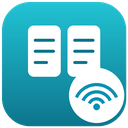

# 591 廣告 vs i智慧 自動比對工具

<p align="center">
  
</p>

<p align="center">
  Chrome 擴充功能 — 一鍵比對 <a href="https://is.ycut.com.tw/">i智慧</a> 關注物件與 <a href="https://user.591.com.tw/">591 會員中心</a> 上架廣告
</p>

<p align="center">
  
  
  
  
</p>

## 這一版做了什麼改變

v1.7.0 把 i智慧 端的取得方式整個換掉了。

| | 舊做法（v1.6 以前） | 現在（v1.7.0） |
|---|---|---|
| i智慧 取資料 | 注入腳本，直接呼叫內部 API（`take:100`，幾秒內約 20 次） | **CDP Network 攔截**：讀頁面自己收到的回應 |
| 對 i智慧 發出請求 | 擴充自己發 | **不發**，全部由頁面在模擬翻頁下自行發出 |
| `is.ycut.com.tw` host permission | 需要 | **不需要**（manifest 裡沒有） |
| 591 取資料 | 注入腳本呼叫 API | 不變 |

換掉的原因是：舊做法在伺服器紀錄上一眼就看得出不是真人操作——`take:100` 是前端介面根本給不出的參數。新做法送出的請求與真人翻頁完全相同，因為那些請求本來就是頁面自己發的。

資料品質不受影響：攔截拿到的是與 API 相同的原始 JSON，不是畫面辨識，所以價格、坪數、樓層都是精確值。

> 詳細的機制說明見 `安裝說明.txt`。

## 功能

- 自動擷取 i智慧「關注物件」清單（Network 攔截，含自動翻頁）
- 自動翻頁失效時可改用手動模式，自己翻頁、工具在旁收資料
- 自動擷取 591 會員中心「開啟中物件」清單
- 比對社區名稱、總價、坪數、樓層、格局
- 全域最佳指派 + 唯一價格救援，避免一對多誤配
- 分成「完美匹配 / 價格不一致 / 需人工確認 / 591 多出 / 關注沒對應」五類
- 完整性防呆：攔到的筆數少於 i智慧 回報的總筆數就不出報表
- 內建使用須知確認、3 天試用、QR Code 授權與遠端緊急停止

## 技術架構

```
背景 service worker (background.js)
├─ 授權 / 試用 / 緊急停止      每次動作前即時查詢，不吃快取
├─ 使用須知閘門                未同意直接開啟須知頁
├─ i智慧 擷取                  chrome.debugger + Network.enable
│                              clickNextPage() 模擬點「下一頁 ›」
├─ 591 擷取                    注入腳本呼叫 bff-user API
└─ 比對邏輯                    scorePair / compareData

popup.html + popup.js          操作介面、QR Code 授權面板
report.html + report.js        比對報表
disclaimer.*                   首次使用須知（強制閱讀）
src/                           config / core-access / disclaimer / local-qr
lib/qrcode-generator.mjs       本機 QR Code 產生
```

### 兩邊各有兩條實作

`background.js` 最上方的 `SOURCE_MODE` 決定實際跑哪一條：

```js
const SOURCE_MODE = {
  ismart: 'intercept',   // 'intercept' | 'api'
  s591:   'api'          // 'api' | 'intercept'
};
```

四條路都在原始碼裡，未啟用的保留備用。刻意不做成 UI 選項——這兩條路的產出會影響「要不要下架廣告」，讓使用者隨手切換只會增加誤判機會。

其中 i智慧 的 API 路徑**改了設定也跑不起來**，因為 manifest 沒有對應的 host permission。要啟用必須同時改設定與 manifest，這是刻意的雙鎖。

## 安裝

1. `chrome://extensions` → 開啟「開發人員模式」
2. 「載入未封裝項目」→ 選這個資料夾

不需要 native host、不需要下載辨識模型。

## 使用

1. Chrome 先登入 i智慧，也登入 591
2. 切到 i智慧「關注物件」清單頁
3. 按擴充 → 「🚀 自動擷取並比對」

首次使用會先要求閱讀使用須知；未授權時會自動顯示 QR Code，請管理員核准後幾秒內自動解鎖。

## 開發

```bash
npm test
```

測試涵蓋：

| 檔案 | 守住什麼 |
|---|---|
| `tests/build-check.cjs` | ES module 語法、manifest 引用、import 路徑、版號一致性 |
| `tests/disclaimer.test.cjs` | 同意紀錄的儲存契約、章節完整性與編號、閘門位置 |
| `tests/kill-switch.test.cjs` | 授權分類器、不吃快取、fail-closed、四個入口的閘門順序 |
| `tests/privacy-license.test.cjs` | **manifest 不得含 is.ycut.com.tw**、QR 本機產生、政策與實作同步 |

最後一項的第一條是本專案最重要的不變條件：整個「零注入」設計就建立在沒有那個權限上。

## 授權與產品代號

產品代號 `listing_compare`，與後台的授權、試用、到期日、緊急停止對應。

管理員可隨時在後台停用該產品，使用者下一次按任何按鈕就會被擋下（不吃快取，即時生效）。

## 免責

本工具僅供有合法存取權限的使用者用於自己的帳號資料。使用前請閱讀完整的使用須知與免責聲明（擴充功能內建，或見 `disclaimer.html`）。
